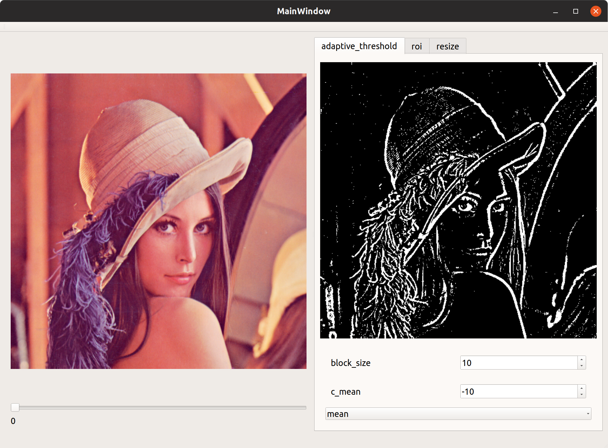

# Panoramix - Visual playground for your image processors.

Tool for graphically testing computer vision image processors.



## Installing external dependencies

### Dependencies managed by conan
- Catch2
- Trompeloeil
- Json

Run the following commands for install the dependencies:

```bash
mkdir build && cd build
conan install ..
```

### Other dependencies
Install this dependencies manually in the system: 
- OpenCV 3
- Qt5

## Building the project

### Using CMake

To compile any target in the project, you can directly use CMake. Create a build directory manually and generate the 
Makefiles in it. 

```bash
mkdir build && cd build
cmake ..
make
```